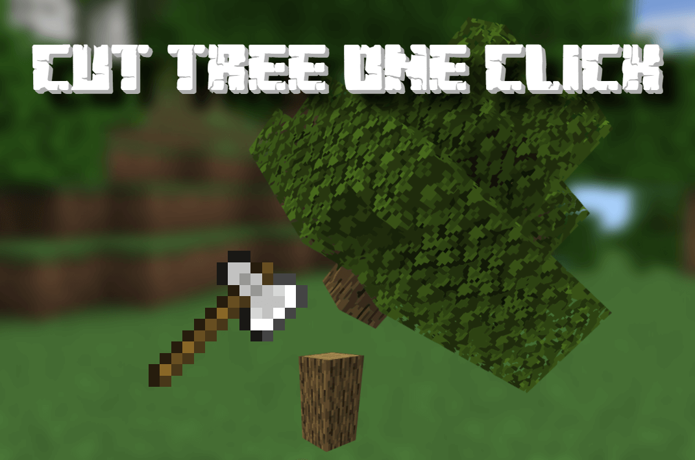

# Cut tree one click

Cutting trees in minecraft is really a waste of time

## Download

> required enable Beta API

To download, you need to go to the GitHub repository [releases](https://github.com/Lete114/WebStack-Screenshot/releases)

## Debugger

Please see the official instructions for details: [https://github.com/Mojang/minecraft-debugger](https://github.com/Mojang/minecraft-debugger)

After entering the game, you need to execute this command `/script debugger connect localhost 19144` for debugging

## LICENSE

Please note that the open source license is GPL-2.0 and you should strictly adhere to it.

- Why is it GPL-2.0 license?
- Because I had a lot of trouble developing this mod, and I wanted to learn from it or see how others wrote it, but all I saw was ugly or obfuscated JavaScript code, and I hope that every minecraft player or minecraft mod developer will make the source code public so that more people can learn and make the mod, making the minecraft community community more active and make minecraft more playable. Of course, I also hope that when you borrow someone else's code or other content, you mark it with the author's name, **please respect every open source mod author!**
